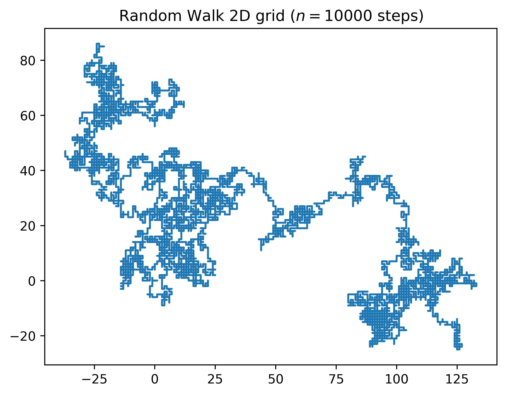

# 🌀 Random Walk in Stochastic Processes  

This repository focuses on **Random Walk** a specific type of stochastic process.
The goal is to provide theoretical and practical examples to understand, simulate, and visualize this probabilistic model and explore its various applications. 

---

## 📖 Repository content  

```bash
Random-Walk_Stochastic-Processes_HAMC/
├── README.md
├── docs
│   ├── conclusions.md
│   └── images
├── notebooks
│   ├── 00_RandomWalk1D.ipynb
│   ├── 01_Random-Walk-2D.ipynb
│   ├── plots
│   │   └── 00_RandomWalk1D.png
│   └── rand_walk_grid100000.pdf
├── requirements.txt
├── src
├── tree.py
└── tree_readme.md
```

---

## 🧮 ¿What is a random walk?  

A **Random Walk** is a stochastic process in which a value evolves in succesive random steps.  

📊 It is used in :  
- **Finance** (model asset prices).  
- **Physics** (Brownian motion).  
- **Biology** (particle scattering).  
- **IA / Machine Learning** (simulating random environments).  

---
## 📊 Visualizations

### 🔹 Random Walk 1D

This 1D Random Walk generates a sequence of values where each element randomly increases, decreases, or remains the same relative to the prevoius one.

When graphed, the trajectory forms a wavy pattern, similar to the signals on an electrocardiogram, visually demonstrating the unpredictable nature of the stochastic process.


### 🔹 Random Walk 2D

This model simulates a random walk on a 2D plane, where at each step the position can change in any of four possible directions. The resulting trajectory is erratic and random, reminiscent of the Brownian motion particles in a fluid. This type of simulation allows the study of discrete stochastic processes and the observation of emergent patterns of random systems.



---

## 🚀 Installation and use  

To clone the repository, install dependencies, and run the notebooks, follow these simple steps:

1.  **Clone the reposity**:
    ```bash
    git clone https://github.com/HA-MC/Random-Walk_Stochastic-Processes_HAMC.git
    cd Random-Walk_Stochastic-Processes_HAMC
    ```

2.  **Install the dependencies**:
    ```bash
    pip install -r requirements.txt
    ```

3.  **Open notebooks with Jupyter**:
    ```bash
    jupyter notebook
    ```
---


## Results and Conclusions

- 1D random walk simulations were performed with up to N user-defined steps.
- The results show that the final position can vary widely due to randomness.
- These simulations allow for the introduction of concepts of stochastic processes and probability theory.